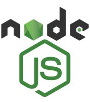
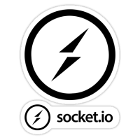
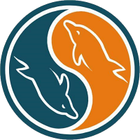
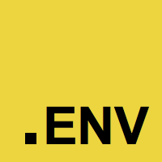
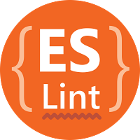
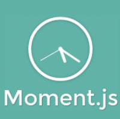
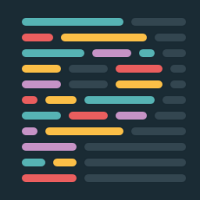
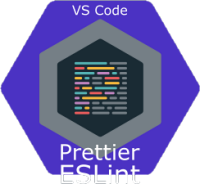

# Segunda Entrega Proyecto Final

## Facundo Creus

## Stack

<h5 align="center">App en Node JS. Código en Typescript. Servidor Express. Motor de Plantillas Handlebars. WebSocket Socket.IO</h5>
<h5 align="center">Persistencia: Memoria - File System / Motores de Bases de Datos: - MongoDB - MySQL - SQLite 3 - Firebase</h5>
<h5 align="center">Librerías Auxiliares: Cookie Parser - DotEnv - ES Lint - Prettier - Jest - Faker - Normalizr - Knex - Moment.js - Mongoose - UUID - Connect-Mongo - Etc.</h5>

    <table>
        <tr>
            <td></td>
            <td></td>
            <td></td>
            <td></td>
            <td></td>
            <td></td>
        </tr>
        <tr>
            <td></td>
            <td></td>
            <td></td>
            <td></td>
            <td></td>
            <td></td>
        </tr>
        <tr>
            <td></td>
            <td></td>
            <td></td>
            <td></td>
            <td></td>
            <td></td>
        </tr>
        <tr>
            <td></td>
            <td></td>
            <td></td>
            <td></td>
            <td></td>
            <td></td>
        </tr>
    </table>

 
 

## ENDPOINTS LOCALHOST

### Productos:

`GET - All Productos: http://localhost:8080/api/productos/`

`GET - Single Producto: http://localhost:8080/api/productos/:id`

`POST - Producto: http://localhost:8080/api/productos/`

`PUT - Producto: http://localhost:8080/api/productos/:id`

`DELETE - Producto: http://localhost:8080/api/productos/:id`

### Carrito:

`GET - All Items: http://localhost:8080/api/carrito/`

`GET - Single Item: http://localhost:8080/api/carrito/:id`

`POST - Item: http://localhost:8080/api/carrito/:id_producto`

`DELETE - Producto: http://localhost:8080/api/carrito/:id`
